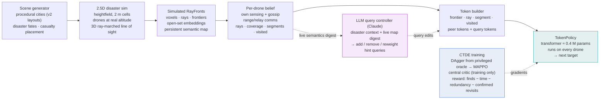

# System architecture (editable mermaid source)

Key points the figure should carry on a slide:
- **Decentralized execution**: everything right of RayFronts runs per drone; there is no central planner.
- **Open-set semantics**: the policy consumes raw embeddings + query tokens, never class labels or thresholds.
- **The LLM is out of the control loop**: it edits the query channel closed-loop from the live map digest; the policy decides where to fly.
- **CTDE**: the central critic exists only during training.
